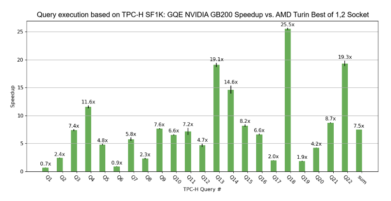

# GPU Query Engine (GQE)

`GQE` is a proof-of-concept SQL query engine for running data analytics queries on GPUs. Its purpose is to achieve speed-of-light performance and serve as a blueprint to inform your database engine design.



*Single-GPU speedup against DuckDB. Total GQE execution time for all 22 queries at scale factor of 1000: 9.15 s.*[^*]

## Build GQE

Please see the [contributing guide section](CONTRIBUTING.md#setting-up-your-build-environment) on setting up the build environment and building GQE and the SQL client.

## Run GQE

Start the node manager (it spawns one task manager per GPU):

```bash
./build/src/node_manager/gqe_node_manager \
  --address 127.0.0.1 \
  --port 50051 \
  --num-gpus 1 \
  --task-manager-binary ./build/src/task_manager/gqe_task_manager
```

To use multiple GPUs, raise `--num-gpus`. The node manager spawns one task manager subprocess per GPU and distributes query execution across them:

```bash
./build/src/node_manager/gqe_node_manager \
  --address 127.0.0.1 \
  --port 50051 \
  --num-gpus 8 \
  --task-manager-binary ./build/src/task_manager/gqe_task_manager
```

The node manager opens its TCP port only after all task managers have started and NVSHMEM bootstrap has finished, so a successful TCP connect is a reliable readiness signal.

To drive the whole workflow from a single terminal, start the node manager in the background, redirect its logs to a file, and wait for the port to open before running clients:

```bash
./build/src/node_manager/gqe_node_manager \
  --address 127.0.0.1 \
  --port 50051 \
  --num-gpus 1 \
  --task-manager-binary ./build/src/task_manager/gqe_task_manager \
  > /tmp/gqe_node_manager.log 2>&1 &

until nc -z 127.0.0.1 50051; do sleep 0.5; done

# ... run load_tpch.py, gqe-cli, etc. ...

kill %+   # stop the most recent background job (the node manager)
```

`kill %+` sends SIGTERM; the node manager handles it gracefully, terminating its task managers and cleaning up shared memory before exiting.

### Creating tables and loading data

Use `CREATE TABLE` followed by `COPY ... FROM '<directory>' (FORMAT parquet)`. The `COPY` source is a directory containing one or more Parquet files.

```bash
./rust/target/release/gqe-cli --server-url http://127.0.0.1:50051 --sql-file - <<'EOF'
CREATE TABLE sales (
  region    VARCHAR,
  sale_date DATE,
  amount    BIGINT
);
COPY sales FROM '/data/sales' (FORMAT parquet);
EOF
```

Tables live in GPU memory until the node manager exits, so later queries run without reloading.

#### Creating `EXTERNAL` tables from Parquet files without loading into memory
If desired (e.g. table size exceeds memory capacity), Parquet file-backed `EXTERNAL` tables can be created without occupying memory.

```bash
./rust/target/release/gqe-cli --server-url http://127.0.0.1:50051 --sql-file - <<'EOF'
CREATE EXTERNAL TABLE sales (
  region    VARCHAR,
  sale_date DATE,
  amount    BIGINT
) STORED AS PARQUET LOCATION '/data/sales';
EOF
```

Queries run against file-backed tables read the files directly from disk. Note that the `EXTERNAL` keyword is optional but is recommended for clarity.

### Running queries

From stdin:

```bash
echo 'SELECT region, sum(amount) FROM sales GROUP BY region' | \
  ./rust/target/release/gqe-cli \
  --server-url http://127.0.0.1:50051 \
  --sql-file -
```

From a file, saving the result to Parquet:

```bash
./rust/target/release/gqe-cli \
  --server-url http://127.0.0.1:50051 \
  --sql-file queries/q1.sql \
  --parquet q1_result.parquet
```

### TPC-H workflow

`scripts/load_tpch.py` issues the schema and `COPY` statements for the eight TPC-H tables. It takes a data directory as its positional argument; the directory must contain `ci_schema.sql` and one Parquet subdirectory per table (`customer/`, `lineitem/`, `nation/`, `orders/`, `part/`, `partsupp/`, `region/`, `supplier/`).

```bash
./scripts/load_tpch.py \
  --server-url http://127.0.0.1:50051 \
  /path/to/tpch/sf1
```

`scripts/run_tpch.py` runs one or more of the 22 TPC-H queries from a directory containing `q1.sql` ... `q22.sql`:

```bash
# Run a single query
./scripts/run_tpch.py --server-url http://127.0.0.1:50051 /path/to/tpch/queries 1

# Run several
./scripts/run_tpch.py --server-url http://127.0.0.1:50051 /path/to/tpch/queries 1 5 14

# Run all 22 queries
./scripts/run_tpch.py --server-url http://127.0.0.1:50051 /path/to/tpch/queries all

# Run all 22 queries and validate each against reference Parquet results
./scripts/run_tpch.py \
  --server-url http://127.0.0.1:50051 \
  --validate /path/to/tpch/reference_results/sf1 \
  /path/to/tpch/queries all
```

## Configuration

### Environment variables

| Variable | Default | Description |
|---|---|---|
| GQE_LOG_LEVEL | info | Enable log messages for this level or higher. |
| GQE_LOG_FILE | — | Write log messages to this file path. |
| MAX_NUM_WORKERS | 1 | Maximum number of worker threads per stage. |
| MAX_NUM_PARTITIONS | 8 | Maximum number of read tasks that can be generated for a single table. |
| GQE_INITIAL_QUERY_MEMORY | 10 GiB | Initial per-query memory pool size (in bytes). Ignored in multi-GPU mode (symmetric memory region is not growable). |
| GQE_MAX_QUERY_MEMORY | 90% of free device memory | Maximum per-query memory pool size (in bytes). |
| GQE_INITIAL_TASK_MANAGER_MEMORY | 10 GiB | Initial task-manager memory pool size (in bytes). Used across queries, e.g., for in-memory tables. |
| GQE_MAX_TASK_MANAGER_MEMORY | unlimited | Maximum task-manager memory pool size (in bytes). |
| GQE_JOIN_USE_HASH_MAP_CACHE | false | Allow multiple join tasks to reuse the same hash map. May increase device-memory usage. |
| GQE_JOIN_USE_UNIQUE_KEYS | true | Optimize inner joins with unique build-side keys using a hashset instead of a hash multiset. |
| GQE_JOIN_USE_PERFECT_HASH | true | Allow perfect hashing for joins on unique, non-null build-side keys. |
| GQE_JOIN_USE_MARK_JOIN | true | Use mark join for left semi/anti joins where LHS < RHS; falls back to cuDF if disabled. |
| GQE_AGGREGATION_USE_PERFECT_HASH | true | Enable perfect hashing for group-by aggregations. |
| GQE_FILTER_USE_LIKE_SHIFT_AND | true | Use shift-and optimization for LIKE patterns with middle segments ≤ 64 chars. |
| GQE_READ_USE_ZERO_COPY | true | Enable zero-copy reads for in-memory tables. When disabled, reads copy into a temporary buffer. |
| GQE_USE_OVERLAP_MTX | true | Use locks in memory read tasks to improve overlap and pipelining. Suboptimal with compressed columns. |
| GQE_USE_OPT_TYPE_FOR_SINGLE_CHAR_COL | true | Use optimized char type instead of string for single-char columns (currently only for TPC-H). |
| GQE_IN_MEMORY_TABLE_USE_SHARED_MEMORY | false | Use inter-process shared memory for the in-memory table. |
| GQE_USE_PARTITION_PRUNING | false | Enable partition pruning for in-memory tables. |
| GQE_ZONE_MAP_PARTITION_SIZE | 100000 | Rows per zone-map partition. Setting this to 0 disables zone maps (and therefore partition pruning). |
| GQE_NUM_SHUFFLE_PARTITIONS | 2 | Number of shuffle partitions for shuffle join. |
| GQE_IN_MEMORY_TABLE_COMPRESSION_FORMAT | none | Primary nvCOMP format for in-memory table compression. Values: `none`, `ans`, `lz4`, `snappy`, `cascaded`, `gdeflate`, `deflate`, `zstd`, `gzip`, `bitcomp`. |
| GQE_IN_MEMORY_TABLE_COMPRESSION_RATIO_THRESHOLD | 1.0 | Compression-ratio threshold below which the primary format is skipped and columns are stored uncompressed (or with the secondary format). |
| GQE_IN_MEMORY_TABLE_COMPRESSION_CHUNK_SIZE | 16 | `n` in 2^n — nvCOMP chunk size in bytes. |
| GQE_IN_MEMORY_TABLE_SECONDARY_COMP_FORMAT | none | Secondary nvCOMP format. Same value set as the primary. |
| GQE_IN_MEMORY_TABLE_SECONDARY_COMPRESSION_RATIO_THRESHOLD | 3.0 | Minimum ratio for the secondary format to be considered. |
| GQE_IN_MEMORY_TABLE_SECONDARY_COMPRESSION_MULTIPLIER_THRESHOLD | 1.5 | Secondary is used when its ratio is at least this multiple of the primary's. |
| GQE_DECOMPRESS_BACKEND | default | nvCOMP decompression backend. Values: `default`, `de`, `sm` (case-insensitive). |
| GQE_USE_CPU_COMPRESSION | false | Use CPU compression for in-memory table compression. |
| GQE_COMPRESSION_LEVEL | 10 | LZ4 CPU compression level (1–12). Higher values compress better but more slowly. |
| GQE_IN_MEMORY_DUMMY_COPY_MULTIPLIER | 1.0 | Target total copy multiplier for batched memcpy in in-memory read tasks. Must be `>= 1.0`; `1.0` disables extra dummy memcpy work. |

See [docs/customized_parquet_reader/README.md](docs/customized_parquet_reader/README.md) for the additional `GQE_USE_CUSTOMIZED_IO` and `GQE_IO_*` variables that tune the customized Parquet reader.

### CUDA device and NUMA affinity

The GPUs GQE uses can be restricted by setting [the `CUDA_VISIBLE_DEVICES` environment variable](https://docs.nvidia.com/cuda/cuda-programming-guide/05-appendices/environment-variables.html#cuda-visible-devices). The node manager spawns one task manager per GPU (up to `--num-gpus`) and assigns each task manager a distinct device from the visible set.

The NUMA affinity of a device depends on the system topology. When memory kind is specified as `numa` or `numa_pinned`, GQE allocates tables on the NUMA node affine to the device used for table registration. In multi-process execution, NUMA node selection occurs per process.

### Partition pruning

If a table is split into multiple Parquet files, the lexicographical sort order of the file names has to correspond to the sort oder of the rows in the table, for pruning to be effective. This means that numbers in the file names have to be padded with leading zeros.

Good: `lineitem01.parquet`, ... , `lineitem09.parquet`, `lineitem10.parquet`

Bad: `lineitem1.parquet`, ... , `lineitem9.parquet`, `lineitem10.parquet`

## Experimental features

Optional components, each guarded by its own CMake flag. See the linked docs for build instructions and feature-specific environment variables.

- **Offline Substrait plan producer** — generates Substrait binary plans from SQL outside the client-server flow. See [docs/substrait_producer/README.md](docs/substrait_producer/README.md).
- **Customized Parquet reader** — a prototype reader that is more performant but limited in functionality. See [docs/customized_parquet_reader/README.md](docs/customized_parquet_reader/README.md).
- **Query compiler** — MLIR-based JIT that compiles relational operators into used NVVM IR kernels. See [docs/compiler/README.md](docs/compiler/README.md) for the design and [test/compiler/README.md](test/compiler/README.md) for building and running the MLIR tests.

## Contributors

- Bret Alfieri
- Clemens Lutz
- Daniel Juenger
- Dhruv Sundararaman
- Eric Schmidt
- Eyal Soha
- Hao Gao
- James Xia
- Jiachun Li
- Kate Cheng
- Lingyan Yin
- Miloni Dipak Atal
- Nico Iskos
- Nuttiiya Seekhao
- Rui Bao
- Siyuan Lin
- Tanmay Gujar
- Tyler Allen
- Viktor Rosenfeld
- Yadu Kiran
- Zhengru Wang

[^*]: The test results in this repository are derived from TPC-H decision support benchmark and aren’t comparable to published TPC-H results, as the test results in this repository do not comply with the TPC-H specification.
